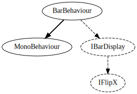
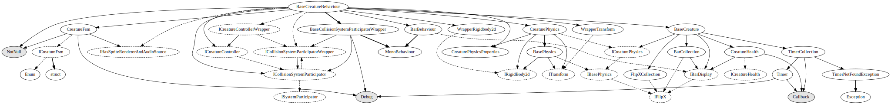
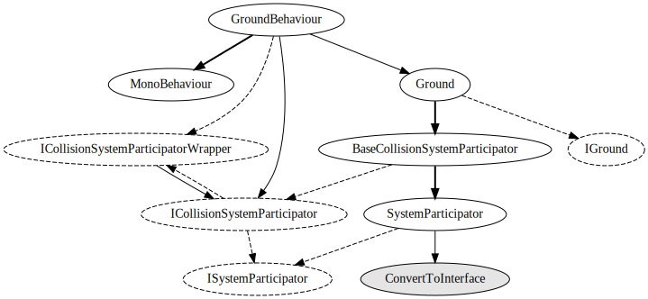
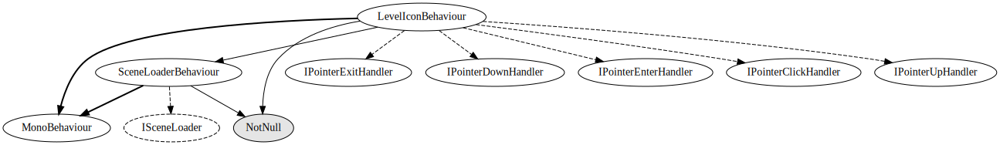
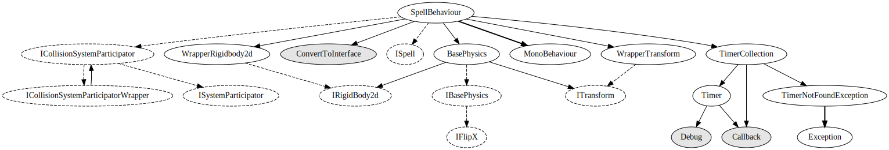
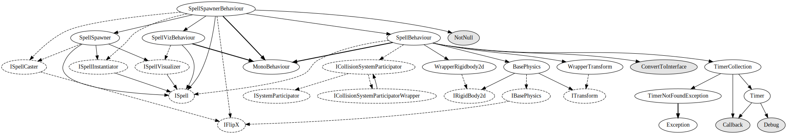
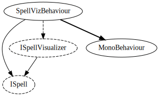

# MonoBehaviours

## BarBehaviour

## BaseCreatureBehaviour

Subclasses (like the player and enemies) are too big to show

## CameraFollowBehaviour

## ChargeEffectBehaviour

## FadeInBehaviour

## GameStateBehaviour

## GroundBehaviour

## LevelIconBehaviour

## MainMenuBehaviour

## PauseMenuBehaviour

## PlayerLocatorBehaviour

Too large to show since it depends on `PlayerBehaviour` which depends on `BaseCreatureBehaviour`.

This is due to the `FindObjectsOfType<PlayerBehaviour>()` call. Apparently
`GetComponent<IPlayerLocator>()` is supposed to work, but it does not for me.

## SceneLoaderBehaviour

## SpellBehaviour

Subclasses inherit from this one and implement e.g. `IDealsDamage` or `IDealsStatusEffect`.

## SpellSpawnerBehaviour

## SpellVizBehaviour

