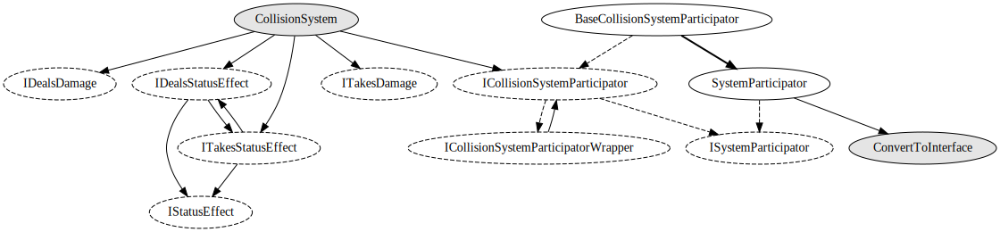

# Collision system

Objects implementing `ICollisionSystemParticipator` can register collisions with other objects
by calling `CollisionSystem.RegisterCollision(this, other)`. Damage and status effects are then
orchestrated according to which interfaces are implemented by the two participators.

