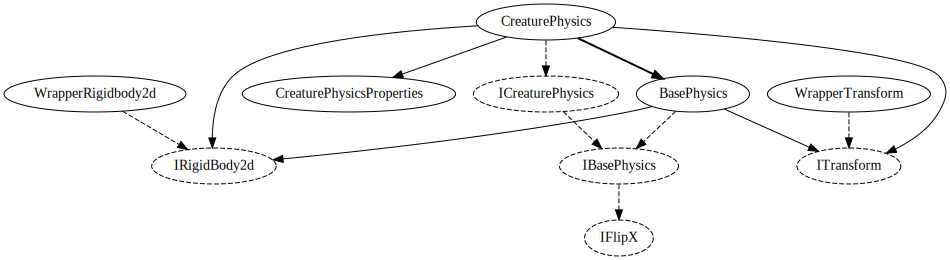

# Creature system

## BaseCreature

Creature controllers should take a `BaseCreature` as their first argument. It holds
most of the stuff that is needed by any creature to make sense.

## CreaturePhysics

A concrete implementation of `ICreaturePhysics`. Inherits from `BasePhysics` and
adds some extra methods that only make sense on a living thing (approaching, looking,
recoiling etc).

## ICreatureControllerWrapper

An interface that is implemented by `BaseCreatureBehaviour`.

## Creature

Empty base class for creature controllers, just there to automatically implement
the `ISystemParticipator` interface.

