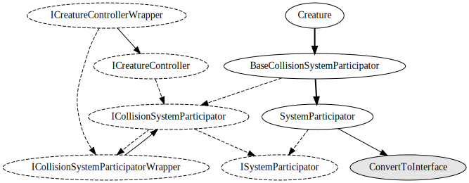
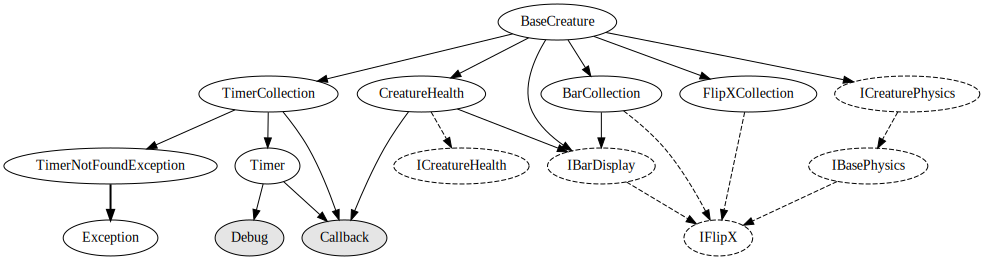

# Creature system

## Creature system

New creatures should inherit from `Creature` and then implement `ICreatureController`.

`ICreatureControllerWrapper` is an interface that is implemented by `BaseCreatureBehaviour`.

## BaseCreature

Creature controllers should take a `BaseCreature` as their first argument. It holds
most of the stuff that is needed by any creature to make sense.

## CreaturePhysics

A concrete implementation of `ICreaturePhysics`. Inherits from `BasePhysics` and
adds some extra methods that only make sense on a living thing (approaching, looking,
recoiling etc).

