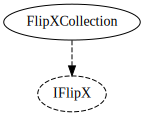

# FlipX system

The `IFlipX` interface is implemented by anything that can flip in the X-direction (e.g. to look at the player).

## FlipXCollection

Holds a `List<IFlipX>` and will relay any changes in its own `FlipX` value to each element of that list.

