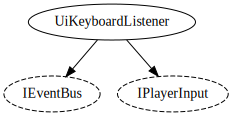

# Game state system

Handles everything to do with the game state.

## GameState

Main `IEventBus` implementation, makes sure everything is consistent with regards to pausing, restarting levels etc.

## UiKeyboardListener

Takes an `IPlayerInput` and converts player keys to events that get relayed to the `IEventBus`.

