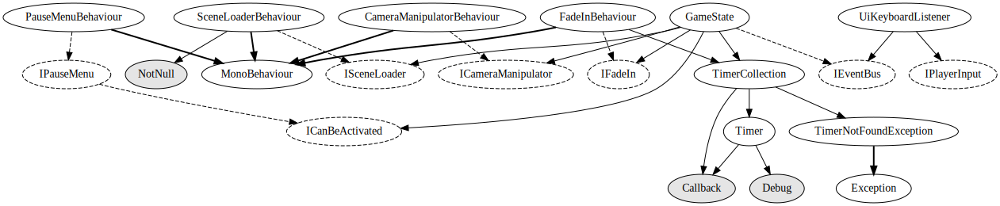

# Game state system

Handles everything to do with the game state. `GameState` is the main `IEventBus` implementation and makes sure everything is consistent with regards to pausing, restarting levels etc. `UiKeyboardListener` takes an `IPlayerInput` and converts player keys to events that get relayed to the `IEventBus`.

