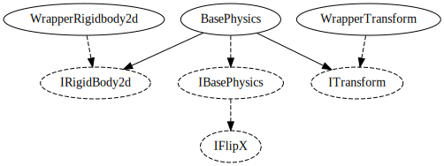

# Physics system

Anything to do with physics.

## BasePhysics

The BasePhysics class implements `IBasePhysics`, exposing a bunch of methods that manipulate
an `IRigidBody2d` and an `ITransform`. The `WrapperRigidBody2d` and `WrapperTransform` classes
implement these interfaces, wrapping Unity's normal RigidBody2d and Transform respectively.

