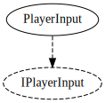

# Player input system

## PlayerInput

Has a `Latch` method that is called to read the inputs. The `IsHeld`, `IsPressedThisFrame` and `IsAnyHeld`
represent the state of the input the last time `Latch` was called. `PlayerInput` uses `Input.GetKey` etc
in the `Latch` method, alternative input methods may do something else.

