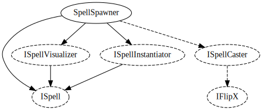

# Spell system

## SpellSpawner

Creates and launches `ISpell` objects. It has an "active spell", i.e. the next
spell to be launched. Currently it will just pick the next spell randomly. It takes an
`ISpellVisualizer` which may visualize the active spell.

An `ISpellInstantiator` must be provided to actually create the `ISpell` objects.

