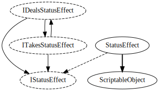

# Status effect system

Objects may implement `IDealsStatusEffect` or `ITakesStatusEffect` in order to
deal or take status effects. The status effect dealer gets to know who received the
status effect.

`StatusEffect` is a concrete implementation of `IStatusEffect`, it just has a

`StatusEffectType` enum value and an intensity.

