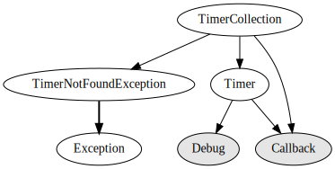

# Timer system

Used to time stuff independently of UnityEngine

## Timer

Basic object for timing, it takes a top value and a timer mode. Can be `Start()`ed, `Stopped()` and `Paused()`.
Starting or stopping a timer is idempotent. Depending on the timer mode it will be a oneshot timer or a wrapping timer.

## TimerCollection

Holds a `List<Timer>` and has a `TickAll` method that will tick all clocks and keep them in a consistent state
(clocks will not start or stop in the middle of a `TickAll` call). Can start, stop or pause individual clocks
by calling e.g. `Start(name)`, will throw a `TimerNotFound` exception if none is found.

