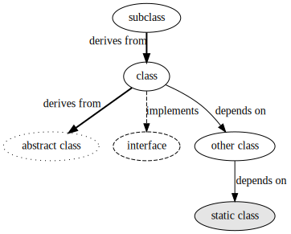

# Heks

A game where you play a witch. Also my first game.

# Status

* **Concept**: Vague.
* **Core gameplay**: Trying out some stuff.
* **Levels**: No.
* **Artwork**: Lol.
* **Audio**: Preliminary.

# Attribution etc

* All artwork, music and SFX is either made by me or is in the public domain.
* All rights reserved until I decide on something more reasonable.

## Folder structure

```
Assets
├───Animations        - Animations (.anim)
├───Audio
│   ├───Music         - Music (.mp3)
│   └───SFX           - Sound effects (.wav)
├───EditorTests       - Unit tests
├───Fonts             - Fonts (.ttf)
├───Graphics
│   ├───backgrounds   - Background images (.png)
│   ├───source        - Source files (.xcf)
│   └───sprites       - Sprite images (.png)
├───Levels            - Scenes (.unity)
├───Prefabs           - Prefabs
├───Scenes            - Obsolete
└───Scripts           - All scripts
```

## Documentation

Documentation for each system is found together with the source (subfolders of `Assets/Scripts/System`).

The dependency graphs use the following colors and styles:



`sh Tools/docgen/generate_images.sh` is run to generate all the images.
